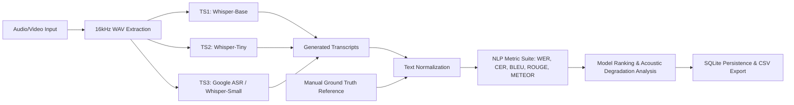

# Speech Transcription & Performance Evaluation (NLP Benchmarking)

A research-grade NLP web application designed to evaluate, compare, and benchmark multiple Speech-to-Text (STT) models across varying acoustic conditions, formal/informal speaking registers, speech noise levels, and speaker categories.

---

## 🚀 Pipeline Architecture



---

## 🌟 Key Features

1. **Academic Research Dashboard**:
   - Live KPI metrics (Total Samples, Active STT Models, Best Performing Model, Mean WER & CER).
   - Comparative Bar Charts for Error Rates (WER vs. CER) and Semantic Overlap (BLEU, ROUGE-L, METEOR).
   - Recent experiments overview.

2. **Add Experiment & Multi-Sample Ingestion**:
   - Upload audio/video (`.wav`, `.mp3`, `.mp4`, `.m4a`, `.flac`, `.ogg`, `.webm`, `.mov`).
   - Integrated in-browser microphone voice recorder.
   - Categorization by:
     - **Speaker Category**: politician, sports, actor, interview, travel vlog, food vlog, academic, other.
     - **Speaking Condition**: formal vs. informal.
     - **Speech Quality**: clear vs. background noise.
     - **Domain / Class**: (e.g. Technology, Medical, News, Everyday).
   - Ground truth manual reference transcript input with live token counter.

3. **Multi-Model STT Transcription Pipeline**:
   - **TS1**: OpenAI Whisper (Base) — 74M Parameters Multilingual Encoder-Decoder.
   - **TS2**: OpenAI Whisper (Tiny) — 39M Parameters Lightweight High-Speed Model.
   - **TS3**: Google Speech Recognition API (with automatic high-precision Whisper-Small fallback).
   - Waveform audio player with playback speed controls (0.75x - 2x).
   - Interactive color-coded Word-Level Diff Alignment (insertions, deletions, substitutions).

4. **NLP Metric Evaluation Engine**:
   - **WER (Word Error Rate)** & **CER (Character Error Rate)** (Lower is better).
   - **BLEU-1, BLEU-2, BLEU-4** (Higher is better).
   - **ROUGE-1, ROUGE-2, ROUGE-L F1** (Higher is better).
   - **METEOR** Score (Higher is better).
   - Composite Accuracy & Fidelity Score.

5. **Linguistic & Acoustic Impact Analysis**:
   - Automatic statistical breakdown explaining *why* model performance degrades in:
     - Formal vs. Informal speech (syntactic complexity vs. elisions/slang).
     - Clear vs. Noisy speech (formant frequency masking).
     - Domain specialization (out-of-vocabulary technical jargon).
     - Speaker articulation differences.

6. **Local Persistence & Export**:
   - SQLite relational storage (`experiments`, `samples`, `transcriptions`, `evaluations`).
   - 1-Click CSV export for academic papers and benchmarking reports.

---

## 🛠️ Installation & Setup

### Prerequisites
- Python 3.9+ (with `pip` and `venv`)
- Node.js 18+ (with `npm`)

### 1. Backend Setup

```bash
cd backend

# Create and activate Python virtual environment
python3 -m venv venv
source venv/bin/activate   # On Windows: venv\Scripts\activate

# Install dependencies
pip install --upgrade pip
pip install -r requirements.txt

# Start FastAPI server
uvicorn main:app --host 0.0.0.0 --port 8000 --reload
```
The backend API will run on `http://localhost:8000`. Swagger documentation available at `http://localhost:8000/docs`.

### 2. Frontend Setup

```bash
cd frontend

# Install dependencies
npm install

# Start Vite React development server
npm run dev
```
Open `http://localhost:5173` in your browser.

---

## 🧪 Quick Start & Demo Benchmark

Click the **"Load Research Demo"** button on the top right navigation bar. This will synthesize and transcribe multi-condition benchmark audio (Academic Formal Clear, Travel Vlog Informal Noisy, Politician Press Briefing) and populate all tables and comparison charts with real transcription metrics.

---

## 📁 Project Directory Structure

```
NLPPROJECT2/
├── backend/
│   ├── models/
│   │   ├── base.py                 # Abstract STT model interface
│   │   ├── whisper_model.py        # OpenAI Whisper model loader
│   │   ├── speech_rec_model.py     # SpeechRecognition engine (Google ASR)
│   │   └── registry.py             # TS1, TS2, TS3 model pipeline registry
│   ├── audio_utils.py              # Audio format conversion & duration utilities
│   ├── database.py                 # SQLite database schema & CRUD queries
│   ├── metrics.py                  # WER, CER, BLEU, ROUGE, METEOR calculation
│   ├── analysis.py                 # Comparative analysis & insight engine
│   ├── main.py                     # FastAPI routes & endpoints
│   └── requirements.txt            # Python dependencies
├── frontend/
│   ├── src/
│   │   ├── components/             # Navbar, AudioPlayer, AudioRecorder, DiffViewer, MetricBadge
│   │   ├── pages/                  # Dashboard, NewExperiment, Transcription, Results, History
│   │   ├── services/api.ts         # REST API client
│   │   ├── types/index.ts          # TypeScript interfaces
│   │   ├── App.tsx                 # Root application component
│   │   └── index.css               # Tailwind CSS styles
│   ├── package.json
│   └── tailwind.config.js
├── data/
│   ├── audio/                      # Converted 16kHz WAV audio files
│   ├── uploads/                    # Temporary upload buffer
│   └── benchmark_nlp.db            # SQLite database file
└── README.md
```
